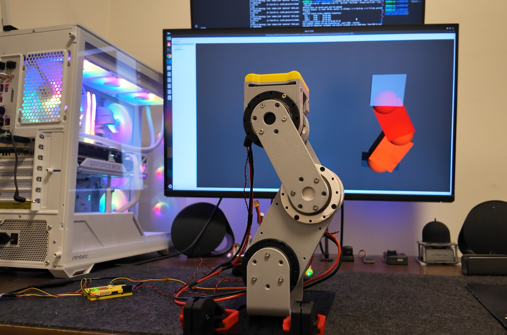
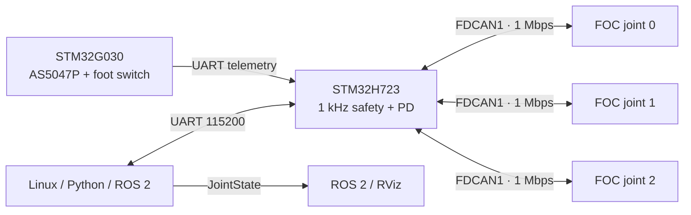

# 5010 3-DOF FOC Kinematic Chain

> A reusable three-joint serial FOC platform for legged-robotics and manipulation research.

[](LICENSE)
[](STM32-H723/)
[](linux/leg_ros2_rviz/)

This project demonstrates a complete hardware-to-ROS 2 control path: distributed CAN FOC actuators, independent output-joint encoders, STM32H723 real-time safety control, Cartesian inverse kinematics, and live ROS 2 / RViz monitoring.

<p align="center">
  
</p>

Videio:
 - YouTube: TODO
 - 哔哩哔哩: https://www.bilibili.com/video/BV1ziem6XE5T/?vd_source=20101db79b24d6ef5e1b776806b05fad

## At a glance

| Area | Details |
| --- | --- |
| Actuation | Three 5010 FOC joints over CAN at 1 Mbps |
| Main controller | STM32H723, 1 kHz outer loop, safety state machine, UART control |
| Encoder node | STM32G030 with AS5047P output encoder and foot switch |
| Host tools | Python IK trajectories, UART console, ROS 2 `JointState`, RViz |
| Control mode | Bounded joint-space PD with torque caps and watchdogs |

## Project map

- [STM32-H723 firmware](STM32-H723/): CAN motor control, safety, PD, UART, IMU, and status LED support
- [G030 encoder firmware](G030-second-encoder/): output encoder and foot-switch telemetry
- [Python kinematics](linux/IK/): forward/inverse kinematics and trajectory generation
- [ROS 2 visualization](linux/leg_ros2_rviz/): URDF, launch files, and RViz configuration
- [CAD assembly](3D%20Model/Let-Assembly.step): mechanical model

## What is demonstrated

- Three serial 5010 FOC joints: hip / knee / ankle, or a reusable 3-DOF arm chain
- CAN-connected motor controllers at 1 Mbps
- STM32H723 1 kHz outer control, safety state machine, and UART command interface
- Independent AS5047P output encoders via an STM32G030 encoder node
- Foot-contact switch input
- Safe commands: `CLEAR`, `ZERO`, `POWER ON`, `ARM`, `DISARM`, `POWER OFF`
- Bounded joint-space PD control and torque caps
- Python Cartesian IK trajectories: crouch, vertical motion, ellipse trajectory, return-to-zero hold
- ROS 2 `JointState` publishing and synchronized RViz visualization
- Hardware safety behaviour: CAN readiness checks, encoder checks, PC/UART watchdog, joint limits, controlled disarm

## System architecture



## Repository layout

```text
3D Model/                  CAD assembly
G030-second-encoder/       Output encoder and foot-switch firmware
STM32-H723/                H723 real-time CAN, safety, PD, UART firmware
linux/
├── IK/                    Forward/inverse kinematics and trajectory runner
├── leg_ros2_rviz/         URDF, ROS 2 package, RViz launch files
├── pc_pd_poc.py           UART control console
└── decode_g030_encoder_uart.py
Image/
└── image.png              Project photo used above
```

## Quick start

### Prerequisites

- Linux with Python 3 and a configured serial port
- ROS 2 with RViz, if visualization is needed
- A mechanically supported leg with verified encoder direction and limits

Install the Python dependencies used by the trajectory tools according to your Linux environment, then run the example from `linux/IK/`.

1. Place the leg in its straight, mechanically supported ZERO pose.
2. Start RViz on Linux.
3. Run a small Cartesian trajectory.
4. Observe measured joint angles in RViz while the H723 retains safety authority.
5. Press `Ctrl-C` at any time: the runner sends `DISARM`, then `POWER OFF`.

Example trajectory:

```bash
cd linux/IK
python3 run_leg_trajectory.py --port /dev/ttyACM0 \
  --motion vertical \
  --vertical-up-mm 20 --vertical-down-mm 15 \
  --kp 0.50 --kd 0.010 --torque-cap 0.120 \
  --ros2 --execute
```

The trajectory returns to `SET 0 0 0`, actively holds the ZERO pose for 60 seconds, then disarms. Use `Ctrl-C` to stop early.

For the UART command console, see [`linux/pc_pd_poc.py`](linux/pc_pd_poc.py). For ROS 2 setup and launch instructions, see [`linux/leg_ros2_rviz/README.md`](linux/leg_ros2_rviz/README.md).

## Safety

This is an experimental high-torque robot actuator platform.

* Keep the leg mechanically supported during bench tests.
* Start with conservative torque caps and small trajectories.
* Verify encoder direction, ZERO pose, CAN health, and joint limits before `ARM`.
* Never assume PC-side software bypasses H723 safety logic.
* Keep clear of the moving links and mechanical end stops.

## Next steps

* Add the fourth hip-roll joint and build a paired-leg platform
* Improve URDF/CAD fidelity and contact visualization
* Add IMU state estimation and contact-aware control
* Move from Cartesian PD trajectories to LQR and reinforcement-learning experiments
* Reuse the same actuator/control stack for serial robotic arms and wheel-leg platforms

## License

This project is licensed under the [MIT License](LICENSE).
